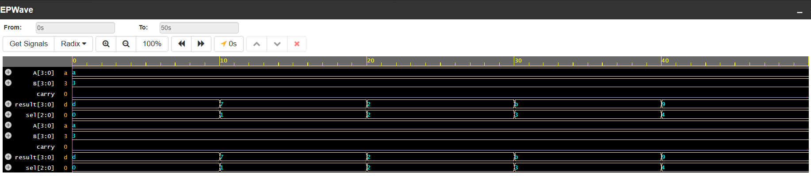

# 4-Bit ALU Design using Verilog HDL

## Overview
This project implements a 4-bit Arithmetic Logic Unit (ALU) using Verilog HDL.

An ALU is a combinational digital circuit that performs arithmetic and logical operations based on the control input. This project is designed to understand RTL design concepts and Verilog coding practices.

## Features
- 4-bit input data processing
- Combinational logic design
- Supports arithmetic and logical operations
- Carry output generation
- Verified using simulation waveform~4-bit ALU. png

## Operations Supported

| Select | Operation |
|--------|-----------|
| 000 | Addition (A + B) |
| 001 | Subtraction (A - B) |
| 010 | AND |
| 011 | OR |
| 100 | XOR |
| 101 | NOT A |
| 110 | Increment A |
| 111 | Decrement A |

## Tools Used
- Verilog HDL
- Icarus Verilog
- EPWave / GTKWave (Waveform Analysis)
- ## Waveform

The following waveform shows the simulation results of the 4-bit ALU.

 

